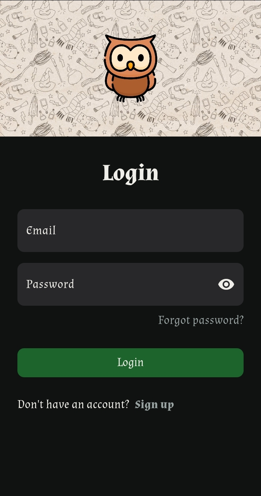
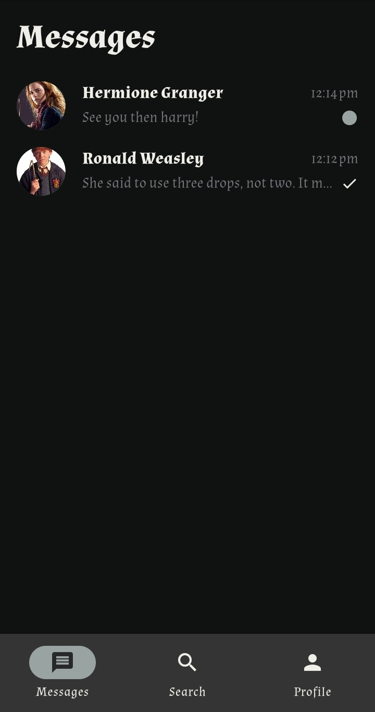
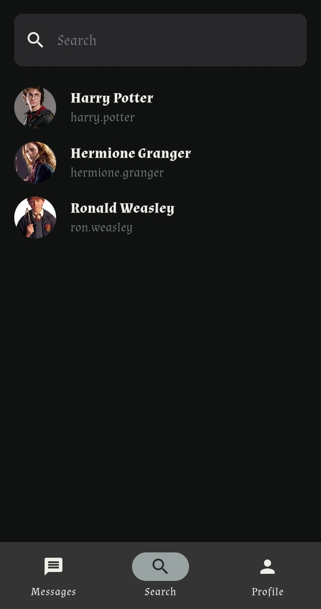
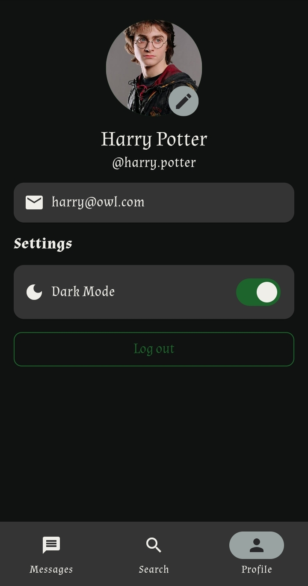
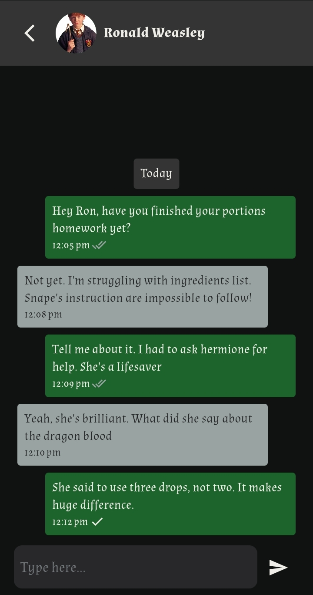

# Owl

Owl is a Flutter-based chat application utilizing Firebase for backend services. This project demonstrates the use of Provider for state management in a real-world application.

## Features and Usage

- **User Authentication**: Secure user authentication using Firebase. Sign Up or Log In using your email and password.
- **Email Verification**: New users need to verify their email. The app will guide you through this process.
- **User Search**: Search for friends by username to start a chat.
- **Real-time Messaging**: Chat with friends in real-time. Send and receive messages instantly.
- **Light and Dark Mode**: Switch between light and dark themes for better user experience.

## Screenshots

    
    
    
     
    

